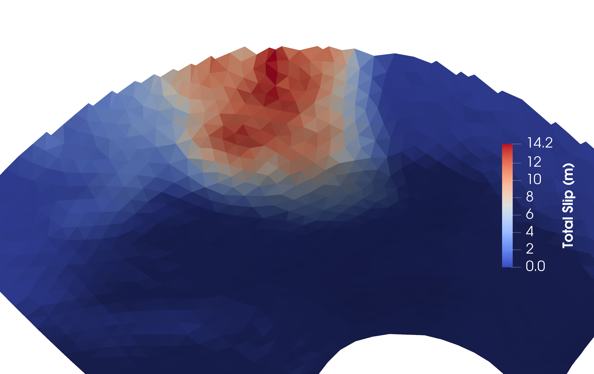

# k223d: generating stochastic slip distributions on unstructured mesh

<p align="center">
  
</p>

[](https://doi.org/10.5281/zenodo.7525448)

## Overview

_k223d_ produces fractal stochastic slip distributions on non-planar faults that are described by triangular mesh. The programme will also provide the rupture time for each location on the fault plane for a given nucleation location and rupture velocity. It is possible to assign surface nodes 

_k223d_ is based on the composite source model technique ([Zeng et al. BSSA, 1994](https://agupubs.onlinelibrary.wiley.com/doi/abs/10.1029/94GL00367)) whereby a set of hierarchical circular patches of slip are randomly placed on the fault plane based on a spatial probablity density function. Each individual patch of slip has a spatial distribution defined as a circular crack ([Ruiz et al., GJI, 2011](https://academic.oup.com/gji/article/186/1/226/697919)). At each point on the fault plane the contribution from the patches of slip at that location are summed together leading to the production of a final slip distribution that is self-similar. A further development has been the inclusion of surface rupture in _k223d_ when surface nodes are specified. In this newest version it is now possible to calculate the travel time of the rupture front across the fault plane using a user defined rupture velocity and a nucleation location.  

In summary this progamme will:
- provide a stochastic slip distribution for each cell. 
- generate surface rupture if requested
- calculate the rupture time across the fault for a given nucleation location and rupture velocity. 

This programme is based on the [slipk2](https://github.com/andherit/slipk2) code for the generation of fractal slip while the kernal for calculating the distance across an unstructured mesh is based on [trilateration](https://github.com/andherit/trilateration)


➡️ For full documentation, see the [Wiki](https://github.com/s-murfy/k223d/wiki)


## Quick Start
Clone the repository:
```bash
git clone https://github.com/s-murfy/k223d.git
cd k223d
```


## Version History 
**Version 2:** Inclusion of rupture time. Standardise input and output of the mesh to a vtk file format. 

**Version 1:** Provide static slip distribution. 


