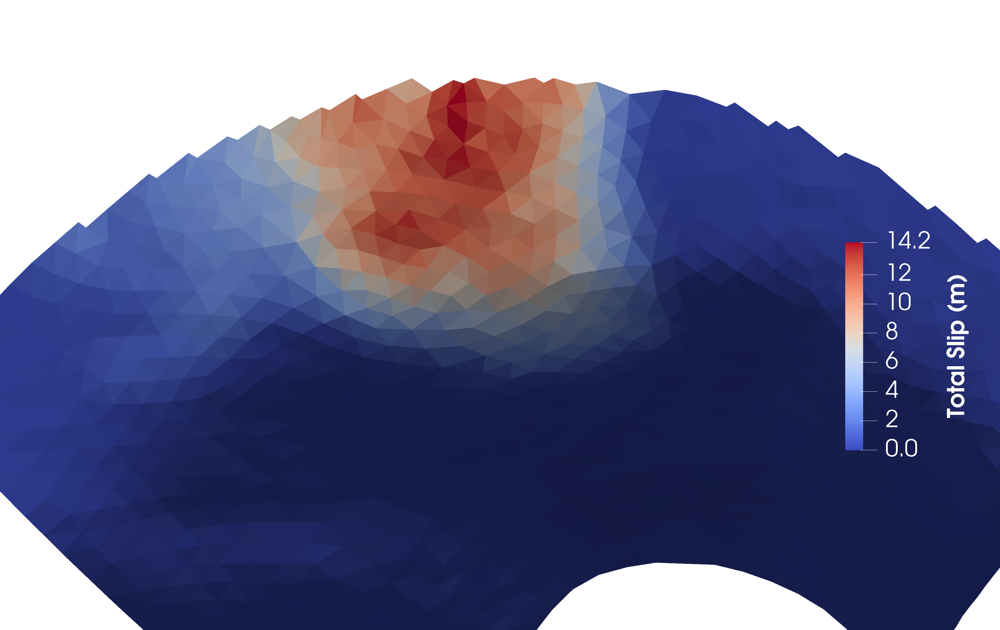

# k223d: stochastic slip distributions on unstructured meshes

<p align="center">
  
</p>

[](https://doi.org/10.5281/zenodo.16759708)
[](LICENSE)


## Overview

_k223d_ generates fractal stochastic slip distributions with k⁻² amplitude spectra on non-planar fault surfaces described by unstructured triangular meshes. As of v3, it can be used as a standalone Fortran executable or called directly from Python, C, C++, or Julia via a C shared-library API.

_k223d_ will:

- generate a stochastic slip distribution for each mesh cell
- optionally account for surface rupture
- optionally calculate the rupture-front arrival time across the fault for a given nucleation point and rupture velocity

_k223d_ is based on [slipk2](https://github.com/andherit/slipk2) for fractal slip generation; geodesic distances across the mesh are computed using the trilateration algorithm from [trilateration](https://github.com/andherit/trilateration).

➡️ **Full documentation:** [Wiki](https://github.com/s-murfy/k223d/wiki)

---

## What's new in v3

- **C API** — _k223d_ is now available as a shared library (`libk223d.so`), callable from Python, Julia, C, and C++
- **Simplified command-line interface** — the Fortran namelist input file has been replaced by command-line arguments (`mw=`, `in=`, `out=`, etc.)
- **Reorganised examples** — the `examples/` directory replaces the old `notebooks/` folder and covers both Fortran and Python workflows

> **Upgrading from v2?** The input interface has changed — see the [migration notes](https://github.com/s-murfy/k223d/wiki/Migration) on the wiki.

---

## Repository layout

```
k223d/
├── code/                   # Fortran source files and Makefile
├── examples/               # Worked examples
│   ├── fortran/            # Fortran-based workflow (planar mesh example)
│   ├── python/             # Python API examples (EFSM20, Earthquakes)
│   └── local_py_scripts/   # Shared Python utilities and k223d Python wrapper
├── requirements.txt
├── Dockerfile
├── CITATION.cff
└── README.md
```

---

## Quick start

### Prerequisites

- A Fortran compiler (gfortran recommended)
- Python ≥ 3.8 with dependencies listed in `requirements.txt`
- Jupyter (for the example notebooks; included in `requirements.txt`)

### Compile

```bash
git clone https://github.com/s-murfy/k223d.git
cd k223d/code
make          # builds k223d.x
make install  # also builds libk223d.so and copies it to examples/local_py_scripts
```

### Run (Fortran executable)

Minimal run — slip distribution only:

```bash
k223d.x mw=6.9 in=input.vtk out=output.vtk
```

Using stdin/stdout for workflow chaining:

```bash
k223d.x mw=6.9 < input.vtk > output.vtk
```

See the [Fortran usage](https://github.com/s-murfy/k223d/wiki/Fortran-Usage) wiki page for all available options.

### Run (Python API)

```python
import k223d

# Minimal: slip distribution only
slip, _ = k223d.compute_source(points, cells, mw=7.0)

# With surface rupture and rupture time
slip, time = k223d.compute_source(
    points, cells, mw=7.0,
    surface_nodes=surface_nodes,  # indices of nodes on the free surface
    velocity=cell_vel,            # rupture velocity per cell [m/s]
    time=itime                    # initialisation time per node
)
```

See the [Python API](https://github.com/s-murfy/k223d/wiki/Python-API) wiki page and the examples in `examples/Python/` for full worked examples.

---

## Docker

A `Dockerfile` is provided if you prefer not to compile locally:

```bash
docker build -t k223d .
docker run -it -p 8888:8888 k223d
```

Then open the URL printed in the terminal (e.g. `http://127.0.0.1:8888/lab?token=...`) in your browser.

---

## Citation

If you use _k223d_, please cite:

> Herrero, A. and Murphy, S., 2018. Self-similar slip distributions on irregular shaped faults. *Geophysical Journal International*, 213(3), pp.2060–2070.

If surface rupture is used, also cite:

> Murphy, S. and Herrero, A., 2020. Surface rupture in stochastic slip models. *Geophysical Journal International*, 221(2), pp.1081–1089.

A full list of references (including mesh generation and visualisation tools used in the examples) is on the [References](https://github.com/s-murfy/k223d/wiki/References) wiki page.
