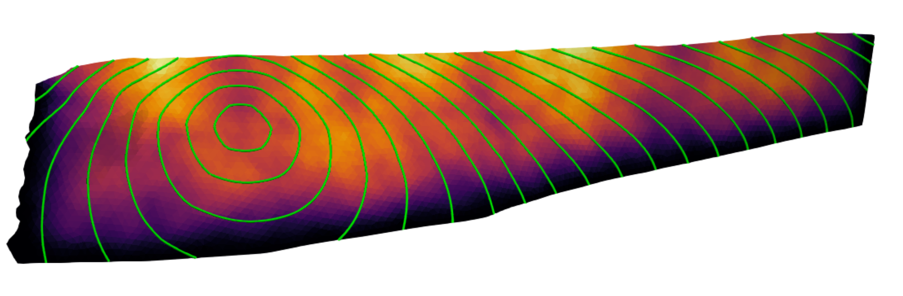

# k223d tutorial : how to read a SCEC CFM fault and place a slip distribution on it 
This a tutorial on how to use [k223d](https://github.com/s-murfy/k223d) with a fault geometry taken from the
[SCEC Community Fault Model](https://www.scec.org/science/community-fault-model/). The tutorial is organised in two steps:

**Step 1** — download one CFM fault object straight from Zenodo,
parse the GOCAD t-surf file, and inspect the mesh. This is done in the notebook: `01_cfm_to_k223d_load_and_inspect.ipynb`

**Step 2** — remesh the surface with `gmsh` to get a quasi-uniform triangulation, assign a
rupture velocity and nucleation point, then run k223d and write the output. See notebook: `02_cfm_to_k223d_run.ipynb`

In this example a M 7.4 slip distribution has been placed on the San Bernardino Mountains section of the San Andreas fault. Green contour lines represent the rupture front at intervals of one second. 

**Acknowledgement:** Notebooks were drafted with the assistance of Claude. 

## Reference 
Marshall, S., Plesch, A., & Shaw, J. (2023). SCEC Community Fault Model (CFM) (Version 6.1) [Data set]. Zenodo. https://doi.org/10.5281/zenodo.8327463

