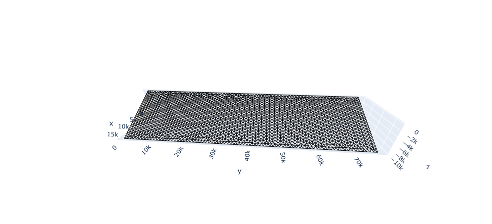

# Generating a slip distribution a planar fault

<h1 align=center></h1>
<h4 align=center>Creation of a slip distribution on a planar fault</h1>

  
   

<table>
<tr>
<td width="50%" align=center>
Meshed planar fault 
</td>
<td width="50%" align=center>
Hetereogeneous slip distribution on fault 
</td>
</tr>
</table>

This notebook shows how to create and mesh a simple planar fault containing triangular cells using [Gmsh](https://gmsh.info/). Above is an example of the type of mesh generated in this notebook. _k223d_ is then called from with in the notebook to generate a stochastic slip distribution on it. 

